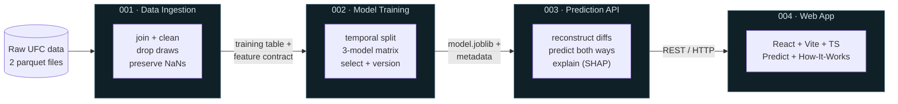
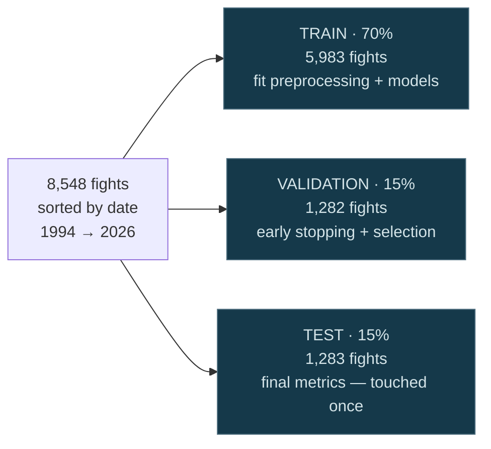
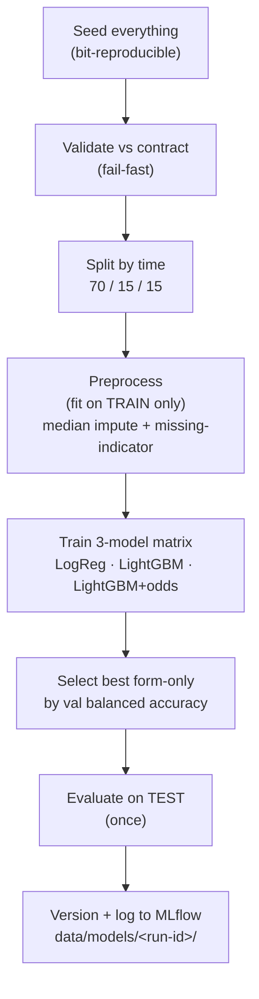
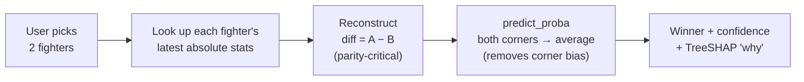

# Featured Project Plan — UFC Fight Outcome Predictor (MLOps)

> Planning doc for adding a **second featured project** to the portfolio. Source of
> truth for the project's facts: `C:\Users\jimmy\Desktop\work\codfe\mlops\mlops\docs\`
> (overview, data-ingestion, model-training, prediction-api, web-app).
>
> **Status:** planning — not yet implemented. See [Open items](#10-open-items--todo).

---

## 0. Why this project earns a "Featured" slot

The existing featured project (**ProductShotAI**) tells a **cloud-architecture / DevOps**
story — microservices, async queues, Terraform, cost optimization. This second project
deliberately tells a **different and complementary** story that the portfolio is
currently missing:

> **"I trained, evaluated, and shipped my *own* machine-learning model — and built the
> entire MLOps lifecycle around it to production standards."**

That distinction matters. A lot of "AI" projects are thin wrappers around someone
else's API (the portfolio already has several RAG / Gemini / OpenAI-SDK projects). This
one is the opposite: **genuine ML engineering** — feature handling, leakage-safe
training, model selection, experiment tracking, reproducibility, versioned artifacts,
explainability, and a serving API — the things that separate "used an AI API" from
"can build and operate an ML system."

### Employer-valued highlights to make unmissable

These are the resume-grade signals; the case-study copy should surface them explicitly:

| Signal | Concrete proof from the project |
|--------|--------------------------------|
| **Trained & refined my own model** | Trained a 3-model matrix (LogisticRegression baseline + 2× LightGBM), tuned for class imbalance, and **selected** the best on a held-out fold. |
| **Leakage-safe ML (real rigor)** | Chronological train/val/test split; preprocessing fit on the **train fold only**; test fold touched exactly once. |
| **Honest evaluation** | Headlines **balanced accuracy (0.596)** not raw accuracy, because of a 64/36 class imbalance — shows the candidate understands *why* a metric is chosen. |
| **MLOps lifecycle** | MLflow experiment tracking, versioned non-overwriting model artifacts, deterministic/bit-reproducible runs. |
| **Production architecture** | Strict modular phases that communicate only through **versioned contracts**; FastAPI serving; Docker → ECR/ECS. |
| **Software-engineering discipline** | **212 backend tests** (unit/contract/integration, TDD), `ruff`/`mypy`/`pydocstyle` quality gates in CI, spec-driven development. |
| **Explainability** | Per-prediction **TreeSHAP** attributions, grouped into human-readable factor families, surfaced in the UI. |
| **Full-stack delivery** | React + Vite + TypeScript web app on top of the API — made the model usable by a non-technical person. |

---

## 1. Project at a glance

- **Product name / branding:** the live app is branded **"CAGE — Combat Analytics &
  Grading Engine"**. Use **"UFC Fight Outcome Predictor"** as the portfolio card title
  (clearer to a recruiter skimming) and mention "CAGE" as the app's name in the copy.
- **What it does:** give it two UFC fighters → it predicts **who wins and a confidence %**,
  and explains **why** (the factors that drove the call).
- **The result:** **59.6% balanced accuracy** on fights it never saw during training —
  real skill above the 50% coin-flip, and within ~1 point of the professional betting market.
- **Scale of data:** learned from **~8,548 historical fights**, **799 engineered diff features**.
- **Shape:** 4 phases — Data Ingestion → Model Training → Prediction API → Web App —
  each a strict module talking only through **versioned contracts**.

---

## 2. Card metadata (collapsed + summary view)

Mirror the structure of `FeaturedProject.jsx`'s collapsed/summary header.

| Field | Value |
|-------|-------|
| **Image** | `projects/ufc-predictor.png` ✅ *(generated — cropped from the Predict page: matchup → result → confidence bar)* |
| **Badge** | `MLOps · Trained ML Model` |
| **Title** | `UFC Fight Outcome Predictor` |
| **Subtitle** | `End-to-End MLOps System with a Self-Trained Prediction Model` |
| **Tagline** | `Machine Learning · MLOps · Full-Stack` |

**Summary blurb (summary view):**

> An end-to-end **MLOps** system that predicts the winner of a UFC fight from two fighters'
> historical statistics. I built all four phases — **data ingestion → model training →
> prediction API → web app** — and, crucially, **trained and selected my own model**
> (LightGBM, 59.6% balanced accuracy on unseen fights) rather than calling someone else's.
> It demonstrates real ML engineering: leakage-safe training, experiment tracking,
> versioned artifacts, reproducibility, explainability, and a production serving API —
> all built to MLOps standards with 212 tests and CI quality gates.

**Summary links** (per the Q&A answers — GitHub + live web app, no video):

| Link label | Sub-label | URL |
|------------|-----------|-----|
| `Live Demo (React App)` | `Predict a matchup` | **TODO — deployed web-app URL** |
| `Source Code` | — | **TODO — public GitHub repo URL** (likely `https://github.com/Pohi11/<repo>`) |

---

## 3. Normal-grid entry (`src/data/projects.json`)

Add this object (recommend placing it **first**, above ProductShotAI, so the two ML
flagships lead the grid). Uses **`id: 9`** (next free id; existing ids are 8,7,5,6,1,3,2,4).

```json
{
  "title": "UFC Fight Outcome Predictor",
  "imageSrc": "projects/ufc-predictor.png",
  "description": "Built an end-to-end MLOps system that predicts UFC fight outcomes. Trained and selected my own model (LightGBM, 59.6% balanced accuracy on unseen fights) on ~8,500 fights, then served it through a FastAPI API and a React web app. Leakage-safe training, MLflow tracking, versioned model contracts, TreeSHAP explainability, and 212 tests.",
  "skills": ["Python", "scikit-learn", "LightGBM", "MLflow", "FastAPI", "MLOps", "React", "TypeScript"],
  "demo": "TODO_WEBAPP_URL",
  "source": "TODO_GITHUB_URL",
  "id": 9
}
```

> **Gotcha check (`ProjectCard.jsx`):** id-based special-casing disables links for
> ids `1,3,4,7` and gives id `8` a three-button layout. **id `9` is "clean"** — it
> will render the standard demo + source layout with both links enabled. No
> `ProjectCard.jsx` change is needed as long as both URLs are real. (If the repo stays
> private, add `9` to the `isSourceDisabled` list instead.)

---

## 4. Case-study tab structure

ProductShotAI's tabs are architecture/cost-flavored. This project's tabs should be
**ML/MLOps-flavored** and lead with the model. Proposed 6 tabs (same count, different story):

1. **Technical Deep Dive** — what it is + the 4-phase contract pipeline (the map).
2. **Training the Model** ⭐ — the centerpiece: data, leakage-safe split, the 3-model
   matrix, imbalance handling, selection, what it learned, honest metrics.
3. **MLOps & Engineering Rigor** — reproducibility, MLflow, versioning, TDD/212 tests,
   spec-driven dev, quality gates, the contract architecture.
4. **Serving & Explainability** — FastAPI request path, corner-bias symmetrization,
   per-prediction TreeSHAP "why", the React web app.
5. **Key Decisions & Challenges** — the "we chose X not Y because Z" cards.
6. **Tech Stack** — the chip list.

Each tab's content is drafted below, ready to drop into JSX (`diagramBlock` /
`challengeCard` / `techStack` patterns reused from `FeaturedProject.jsx`).

---

### Tab 1 — Technical Deep Dive

**Heading:** `Technical Deep Dive: UFC Fight Outcome Predictor`

**Lead paragraph:**

> An end-to-end **MLOps** system that predicts the winner of a UFC fight from the two
> fighters' historical statistics. Under the hood it learned patterns from **~8,548
> historical fights** and reaches **59.6% balanced accuracy** on fights it never saw —
> genuine predictive skill above the 50% coin-flip, and within ~1 point of the
> professional betting market. I built it as **four independent phases** that
> communicate only through well-defined, **versioned contracts**.

**Tech chips:** `Python 3.11` · `pandas` · `scikit-learn` · `LightGBM` · `MLflow` ·
`FastAPI` · `Docker` · `React + Vite + TS`

**Block 1 — The four phases (insert diagram `ufc-pipeline.png`; optionally also the
in-app explainer crop `ufc-howitworks-pipeline.png`):**

> - **001 Data Ingestion** — joins two raw parquet sources, cleans dirty weight-class
>   labels, drops draws, and *deliberately fits nothing* (no imputation, no encoders, no
>   split) so it can never introduce data leakage. Owns the **data contract**: an
>   8,548 × 806 training table + a 2,686-fighter feature index.
> - **002 Model Training** — splits by time, fits leakage-safe preprocessing on the train
>   fold only, trains a 3-model matrix, selects the best, and writes a **versioned model
>   artifact** + MLflow run.
> - **003 Prediction API** — a FastAPI service that reconstructs the head-to-head feature
>   vector at request time and returns winner + confidence + explanation.
> - **004 Web App** — a React + Vite + TypeScript app: a Predict page and a "How It Works"
>   explainer; a pure HTTP consumer of the API.

> **Key architectural principle:** each arrow between phases is a **contract, not a code
> dependency** — 002 only reads 001's published files; 003 only reads 002's published
> artifact. Any phase can be rebuilt independently as long as it honors the contract.

---

### Tab 2 — Training the Model ⭐ (the centerpiece)

> This is the tab that proves "I trained and refined my own model." Lead with it in copy.

**Heading:** `Training & Selecting My Own Model`

**Block 1 — The problem, honestly framed:**

> The goal: from ~800 statistical **differences** between two fighters, predict the
> probability that corner 1 wins — a binary classification problem. It's genuinely hard:
> outcomes are noisy (upsets are common), the classes are **imbalanced (corner 1 wins
> 64%)**, and lots of fighter data is missing by nature (debutants have no history). The
> model has to handle all three honestly.

**Block 2 — Leakage-safe temporal split (insert diagram `ufc-split.png`):**

> I split the 8,548 fights **chronologically**, not at random: 70% train / 15%
> validation / 15% test, in time order. **Why it matters:** predicting fights means
> predicting the *future*. A random split would let the model train on fights that
> happened *after* the ones it's tested on — "look-ahead leakage" that fakes good
> scores. Time-ordering guarantees every training fight precedes every test fight. (It
> also exposed real drift: the corner-1 win rate falls 67% → 55% over time, which makes
> the test honest and harder.)

| Fold | Fraction | Rows | Used for |
|------|----------|------|----------|
| Train | 70% | 5,983 | fit preprocessing + models |
| Validation | 15% | 1,282 | early stopping + model selection |
| Test | 15% | 1,283 | final reported metrics only |

**Block 3 — The 3-model matrix + imbalance handling:**

> I trained **three imbalance-aware models** and let the data pick the winner:

| Model | Algorithm | Imbalance handling | Role |
|-------|-----------|--------------------|------|
| `form_only_baseline` | LogisticRegression | `class_weight="balanced"` | reference baseline |
| `form_only_candidate` | LightGBM | `scale_pos_weight=0.4835` | **shipped** |
| `with_odds_candidate` | LightGBM | `scale_pos_weight=0.4835` | benchmark only (never servable) |

> The LightGBM models use **early stopping** on the validation fold — the shipped model
> stopped after just **9 trees**, finding the signal fast and quitting before
> overfitting. The with-odds model is a **benchmark, not a product**: live betting odds
> aren't available for hypothetical future matchups, so a servable model can't depend on
> them — it exists only to measure how much odds *would* help.

**Block 4 — Model selection:**

> Among the two form-only models I selected the one with the higher **validation**
> balanced accuracy: LightGBM (0.6015) over LogisticRegression (0.5554). Only then was
> the untouched test fold scored, once, for the final honest numbers.

**Block 5 — What the model actually learned (a great "I understand my model" beat):**
*(insert screenshot `ufc-stats-learned.png` — the app's own "stats that mattered most"
panel — and optionally `ufc-model-learned.png` for the 59.6%-vs-market callout.)*

> Out of 1,521 preprocessed columns, the 9-tree model only ever split on **168** —
> it ignored most features entirely. Its most important signals were a surprise:
> **age gap, win record, and physical attributes (weight, reach) outranked raw striking
> volume.** And two of its top four features were *missing-indicators* — the mere fact
> that a fighter's age or reach was unknown (often a debutant) was itself predictive.
> The model discovered this from data, not from me.

**Block 6 — Results, with the honest reading (insert diagram `ufc-model-compare.png`):**

| Model | Balanced accuracy | Raw accuracy |
|-------|-------------------|--------------|
| LogisticRegression baseline | 0.573 | 0.569 |
| **LightGBM (shipped)** | **0.596** | 0.610 |
| LightGBM + odds (benchmark) | 0.606 | 0.616 |
| always-guess-corner-1 | 0.500 | 0.550 |

> **Why balanced accuracy is the headline, not raw accuracy:** because corner 1 wins
> 64% of fights, a model that blindly always guessed "corner 1" scores 64% raw accuracy
> with *zero skill*. Balanced accuracy averages per-class recall, so it can't be gamed by
> the imbalance — **0.50 = no skill, 1.0 = perfect**, and my **0.596** is real signal.
> **Why not 90%?** Fighting is genuinely unpredictable. Even the betting market (with far
> more information) only reaches 0.606 — my form-only model trails it by just **0.0099**,
> meaning it captures almost all the predictable signal that exists from fighter stats
> alone.

---

### Tab 3 — MLOps & Engineering Rigor

**Heading:** `Built to MLOps Standards`

Render as `challengeCard` grid (icon + title + text):

- **🔁 Reproducible by default** — every randomness source seeded; LightGBM runs
  `deterministic=True`, single-threaded. Same data + seed → **bit-identical** metrics,
  proven by an integration test.
- **📦 Versioned, non-overwriting artifacts** — each training run gets a unique version
  (its MLflow run id) written to its own `data/models/<version>/`; prior versions are
  never clobbered. Every param, metric, and seed is logged to MLflow.
- **🧪 Test-driven, 212 tests** — unit + contract + integration tiers, written *before*
  the implementation (TDD). Contract tests pin the exact artifact/response shapes each
  phase depends on; a **served-vs-trained parity test** rebuilds a known training row
  through the serving path and asserts the vector matches.
- **🚧 Strict modular contracts** — four phases that touch each other *only* through
  published, versioned contracts — never internals. Shared config + IO live in one
  `common/` package, never duplicated.
- **✅ Quality gates in CI** — `ruff` (lint+format), `mypy` (strict typing), and
  `pydocstyle` (docstrings) run clean over every phase, plus `gitleaks` for secret scanning.
- **📐 Spec-driven development** — each phase developed with Spec Kit: `spec.md` (what &
  why) → `plan.md` → `research.md` → `contracts/` → `tasks.md` → implementation.

> Optional callout: the project is held to a ratified **constitution** of five
> non-negotiable principles (modular separation, reproducibility, typing+docs, TDD,
> secret hygiene) that every phase demonstrably satisfies.

---

### Tab 4 — Serving & Explainability

**Heading:** `Serving the Model & Explaining the "Why"`

**Block 1 — The serving challenge (insert diagram `ufc-request-path.png`):**

> The model trains on **differences** between two fighters, but a user just names **two
> fighters**. So at request time the API looks up each fighter's latest stats and
> **reconstructs the exact `diff = A − B` feature vector the model was trained on** — and
> it must reconstruct it *exactly* the way training did, or the model gets garbage. That
> feature-parity guarantee is the whole game, and it's pinned by a contract test.

**Block 2 — Removing the corner bias (a sophisticated touch):**

> In the data, the red-corner fighter wins ~64% of the time, so the model learns a corner
> prior — the same matchup scores differently depending on which fighter you arbitrarily
> call "fighter A" (65.7% vs 56.3%). For a hypothetical matchup there's no real red
> corner, so I **symmetrize**: score *both* corner assignments and average them in
> log-odds space, which cancels the prior. Result: `predict(A,B)` and `predict(B,A)` give
> the **identical** answer.

**Block 3 — Per-prediction explainability:**

> Every prediction returns *why*: using **TreeSHAP**, each feature gets a signed
> contribution toward the winner, grouped into human-readable families (Physical,
> Striking, Grappling, Record). The API never inspects the classifier's internals — it
> uses a model-agnostic **explanation seam** exposed by the training phase's contract.

**Block 4 — The web app (insert screenshot `ufc-webapp-predict.png`):**

> A static **React + Vite + TypeScript** app makes it usable by anyone: search two
> fighters by name (with face photos + career records), submit, and see the winner, a
> confidence bar, and the factor breakdown explaining the call. A second "How It Works"
> page is a progressive-disclosure explainer of the whole pipeline. It's a thin,
> read-only HTTP client — no backend, no auth, no database.

---

### Tab 5 — Key Decisions & Challenges

Render as `challengeCard` grid — the "we chose X, not Y, because Z" framing:

- **Preserve NaNs vs. impute early** — Ingestion deliberately *imputes nothing*.
  Imputation must be learned from data; learning it from the whole dataset leaks the
  future into the past. So missing values are preserved as `NaN` and imputed on the
  **train fold only**, downstream. *Missingness itself turned out to be signal.*
- **Temporal split vs. random split** — A random split inflates scores via look-ahead
  leakage. Chronological split keeps the test honest (and harder).
- **Class-weighting vs. resampling** — Used `scale_pos_weight` / `class_weight` to handle
  the 64/36 imbalance instead of over/under-sampling, keeping the data distribution intact.
- **Form-only vs. with-odds model** — The odds model scores higher but can never be
  served (no live odds for hypothetical fights). I shipped the form-only model and kept
  odds purely as a benchmark to quantify the gap (+0.0099).
- **The 6 irregular features (a subtle correctness trap)** — 793/799 diff features map to
  their absolute columns by a regular pattern, but **6 (weight, reach, height, age,
  fight-order, ranking)** use irregular names. A naive "strip the prefix" would silently
  break them at serve time — solved with an explicit, contract-tested mapping.

---

### Tab 6 — Tech Stack

Chip list (`techStack`):

`Python 3.11` · `uv` · `pandas` · `pyarrow` · `scikit-learn` · `LightGBM` · `joblib` ·
`MLflow` · `pydantic-settings` · `FastAPI` · `Pydantic v2` · `Uvicorn` · `Docker` ·
`AWS (ECR/ECS)` · `React 18` · `Vite 5` · `TypeScript` · `Tailwind` · `shadcn/ui` ·
`Recharts` · `pytest` · `Vitest` · `Playwright` · `ruff` · `mypy`

---

## 5. Diagrams (Mermaid → PNG) — ✅ generated, regenerable

**Status: done.** The Mermaid sources live in [`diagrams/`](../diagrams/) as `.mmd`
files and render to `/assets/projects/` via `npm run diagrams` (see
[§11 Regenerating assets](#11-regenerating-assets-scripts)). Edit a `.mmd` and re-run
to update its PNG. The sources are reproduced below for reference.

### `ufc-pipeline.png` — the four-phase contract pipeline



### `ufc-split.png` — leakage-safe temporal split



### `ufc-train-flow.png` — the training pipeline



### `ufc-request-path.png` — serving a prediction



### `ufc-model-compare.png` — balanced accuracy comparison

> Simplest as a bar chart exported from anywhere, or a Mermaid `xychart-beta`. Bars:
> always-corner-1 **0.500**, LogReg **0.573**, **LightGBM (shipped) 0.596**, betting
> market **0.606**. Annotate "0.50 = no skill" and "shipped model" callouts.

---

## 6. Image / asset checklist (`/assets/projects/`) — ✅ all generated

All assets below now exist in `/assets/projects/`. Diagrams come from Mermaid
(`npm run diagrams`); screenshots are crops of the two CAGE full-page screenshots in
`temp-images/` (`npm run crops`). Both are committed and regenerable — see [§11](#11-regenerating-assets-scripts).

| File | What it is | Source | Used by |
|------|------------|--------|---------|
| `ufc-predictor.png` ✅ | Card hero | crop · Predict page (matchup → result → bar) | card header |
| `ufc-webapp-predict.png` ✅ | Result + Top Factors + Factor Breakdown | crop · Predict page | Tab 4 (Serving & Explainability) |
| `ufc-matchup.png` ✅ | Two-fighter selection header | crop · Predict page | optional / Tab 4 |
| `ufc-factors.png` ✅ | Top Factors chart + breakdown families | crop · Predict page | optional / Tab 4 |
| `ufc-howitworks-pipeline.png` ✅ | In-app 3-phase explainer cards | crop · How It Works page | Tab 1 (Deep Dive) |
| `ufc-model-learned.png` ✅ | 59.6% balanced-accuracy callout vs market | crop · How It Works page | Tab 2 (Training) |
| `ufc-stats-learned.png` ✅ | "Stats that mattered most" list | crop · How It Works page | Tab 2 (Training) |
| `ufc-pipeline.png` ✅ | Four-phase **contract** diagram | Mermaid | Tab 1 (Deep Dive) |
| `ufc-split.png` ✅ | Temporal train/val/test split | Mermaid | Tab 2 (Training) |
| `ufc-train-flow.png` ✅ | Training pipeline flow | Mermaid | Tab 2 (Training) |
| `ufc-request-path.png` ✅ | Serving request path | Mermaid | Tab 4 (Serving) |
| `ufc-model-compare.png` ✅ | Balanced-accuracy bar chart | Mermaid (xychart) | Tab 2 (Training) |

> Reminder: assets live at the **repo root** `/assets/` and are referenced via
> `getImageUrl("projects/<file>")` — same as the existing featured card.

### Recorded crop plan (which section of each screenshot)

The two source screenshots (in `temp-images/`, both 2559px wide) and the regions taken
from each. Coordinates are the `{x, y, w, h}` in `scripts/crop-screenshots.ps1` — tweak
and re-run if anything ever needs re-framing.

**`...18-04-45...png` — Predict page (2559 × 1806):**

| Crop | Region (x, y, w, h) | Captures |
|------|---------------------|----------|
| `ufc-predictor` (hero) | 620, 240, 1340, 640 | Holloway vs McGregor cards → "Max Holloway 53.3%" → confidence bar |
| `ufc-matchup` | 620, 240, 1340, 240 | just the two fighter selection cards |
| `ufc-webapp-predict` | 620, 560, 1340, 1240 | result → confidence bar → Top Factors → Factor Breakdown (Physical expanded) |
| `ufc-factors` | 620, 890, 1340, 910 | Top Factors diverging-bar chart + the breakdown families |

**`...18-05-00...png` — How It Works page (2559 × 2398):**

| Crop | Region (x, y, w, h) | Captures |
|------|---------------------|----------|
| `ufc-howitworks-pipeline` | 620, 360, 1340, 305 | the 3 phase cards (Preparing → Training → Serving) with handoff labels |
| `ufc-model-learned` | 620, 1150, 1340, 210 | the big **59.6%** balanced-accuracy callout + "vs the betting market" |
| `ufc-stats-learned` | 620, 1500, 1340, 480 | "Stats that mattered most" — age/reach/recent-wins/weight/striking-rate gaps |

---

## 7. Implementation plan (component changes)

**Layout decision:** stacked — two featured cards in the same `#featured` section,
each independently expandable.

The current `FeaturedProject.jsx` hardcodes a single ProductShotAI card (all content
inline in JSX). To support two cards cleanly without copy-pasting ~600 lines:

**Recommended refactor (incremental, low-risk):**

1. Extract the existing card body into a reusable `<FeaturedProjectCard project={...} />`
   that takes a config object (collapsed header fields, summary blurb, links, and a
   `tabs` array where each tab is `{ id, label, render }`).
2. Move ProductShotAI's content into a `productShotAI` config object (verbatim — no
   behavior change), and author a `ufcPredictor` config from the tab drafts above.
3. `FeaturedProject.jsx` becomes: `<section id="featured">` → `<h2>Featured Projects</h2>`
   → map over `[ufcPredictor, productShotAI]` rendering a `<FeaturedProjectCard>` each.
   **Order: UFC first** (decided) — lead with the ML flagship, ProductShotAI second.
4. State (`isExpanded`, `isFullDetails`, `activeTab`, `expandedImage`) moves **into**
   `FeaturedProjectCard` so each card expands independently. The image-modal + Escape-key
   `useEffect` moves in with it.
5. Update the section `<h2>` from "Featured Project" → "Featured Projects".

**Lighter-weight alternative (if you want to ship fast):** duplicate the card markup for
a second project below the first within the same section, sharing the CSS module. More
code duplication, but zero refactor risk. Recommend the refactor — it pays for itself
the moment there are two cards.

**No CSS changes required** — both cards reuse `FeaturedProject.module.css`. Verify the
section spacing looks right with two stacked cards.

**Navbar/anchors:** the `#featured` anchor still works (section id unchanged). No
`ScrollNav` change needed unless you want a separate entry.

---

## 8. Copy tone guidance

- **First person, factual, specific.** Lead with verbs and numbers ("Trained a 3-model
  matrix…", "59.6% balanced accuracy on unseen fights"). Avoid hype adjectives.
- **Make the model the hero.** Every other tab supports the "I trained and selected my
  own model, then operated it like production" narrative.
- **Show judgment, not just output.** The honest-metrics beat (why balanced accuracy)
  and the leakage-avoidance beat are what separate this from a tutorial follow-along —
  keep them prominent.

---

## 9. Verification checklist (before merge)

- [ ] Both featured cards expand/collapse independently (no shared state bug).
- [ ] All `ufc-*.png` assets exist in `/assets/projects/` and load (no broken images).
- [ ] Live demo + Source links open the correct URLs (no placeholder left).
- [ ] `projects.json` entry renders in the grid with both buttons enabled (id 9).
- [ ] Image modal + Escape-to-close works on the new card.
- [ ] `npm run build` succeeds; section spacing looks right at the 80% site zoom.
- [ ] Numbers in the copy match the source docs (esp. 0.596, 8,548, 212 tests, 9 trees).

---

## 10. Open items / TODO

1. **Web-app demo URL** — ⏳ needed for the Live Demo link. Placeholder `TODO_WEBAPP_URL`
   is in `projects.json` / card config until provided.
2. **GitHub repo URL** — ⏳ needed for Source Code link. Placeholder `TODO_GITHUB_URL`
   (likely `https://github.com/Pohi11/<repo>`). If the repo stays private, add id `9`
   to `isSourceDisabled` in `ProjectCard.jsx`.
3. ~~App screenshots~~ — ✅ done (7 crops generated from `temp-images/`).
4. ~~Render the Mermaid diagrams~~ — ✅ done (`npm run diagrams`).
5. ~~Confirm card order~~ — ✅ UFC first.
6. ~~Build the component~~ — ✅ done. `FeaturedProject.jsx` is now a thin wrapper that
   maps over `featuredProjects` (UFC first) rendering `<FeaturedProjectCard>`; configs
   live in `projectsData.jsx`; the hand-built `BalancedAccuracyChart` replaces the
   Mermaid bar chart in the Training tab. `projects.json` has the id-9 grid entry.
   Build passes; two-card stack + bar chart verified via Puppeteer screenshots.
7. **Swap real URLs in** once (1)/(2) are known: replace `UFC_DEMO_URL` / `UFC_SOURCE_URL`
   in `projectsData.jsx` **and** the `demo`/`source` in `projects.json`, then remove id `9`
   from the disabled arrays in `ProjectCard.jsx`. Until then both placeholder links render
   as a disabled "Coming soon" state (featured card) / greyed buttons (grid).
8. **`temp-images/`** — raw full-page screenshots kept so crops can be re-run. Optionally
   git-ignore or delete them after the crops are finalized (the crops themselves are
   committed in `/assets/projects/`).

---

## 11. Regenerating assets (scripts)

Two committed, re-runnable scripts produce every UFC asset. Both write into
`/assets/projects/`.

### Diagrams — `npm run diagrams`

- **Sources:** [`diagrams/*.mmd`](../diagrams/) (Mermaid) + `diagrams/mermaid-theme.json`
  (dark theme matching the palette).
- **Renderer:** [`scripts/render-diagrams.mjs`](../scripts/render-diagrams.mjs) — loops
  over every `.mmd`, renders to `assets/projects/<name>.png` via the locally-installed
  `@mermaid-js/mermaid-cli` (added as a devDependency; `npm install` first), at 3× scale,
  transparent background.
- **To change a diagram:** edit the `.mmd`, run `npm run diagrams`. To add one: drop a new
  `.mmd` in `diagrams/` and re-run (no script change needed).

### Screenshot crops — `npm run crops`

- **Source:** the two CAGE screenshots in `temp-images/` (matched by timestamp in name).
- **Cropper:** [`scripts/crop-screenshots.ps1`](../scripts/crop-screenshots.ps1) — a
  zero-dependency PowerShell script (uses built-in `System.Drawing`) with a `$crops`
  table of `{name, src, x, y, w, h}`. **Windows-only** (matches this dev box).
- **To re-frame a crop:** edit its `x/y/w/h` in the `$crops` table and re-run
  `npm run crops`. Coordinates are documented in [§6's crop plan](#recorded-crop-plan-which-section-of-each-screenshot).
- **Note:** if the screenshots are ever retaken at a different resolution, the pixel
  coordinates need re-tuning (they assume the 2559px-wide captures).
```